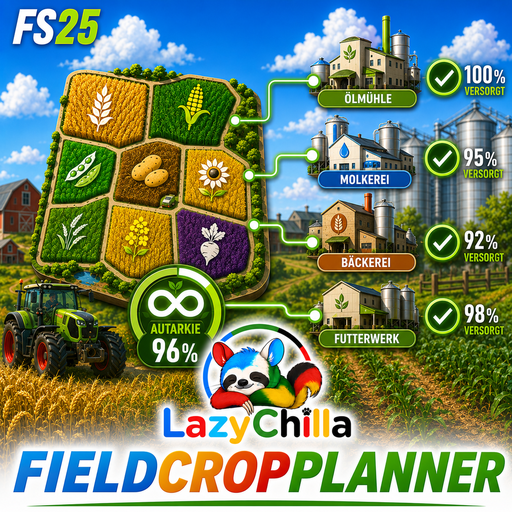

  

<h1 align="center">FS25 Field Crop Planner</h1>

<i>Saatplan-Assistent — plane deinen Anbau auf maximale Autarkie.</i>

> **Version 1.0** — läuft im Spiel und wird weiter gepflegt. Rückmeldungen
> willkommen (siehe *Fehler melden*).

> ⭐ **Gefällt dir der Mod? Lass oben rechts einen Stern da** — ein Klick, und andere finden ihn leichter. · **Like it? Leave a star (top right)** — one click helps others discover it.

---

## Deutsch

Der **Field Crop Planner** rechnet live aus, welche Früchte deine eigenen
weiterverarbeitenden Produktionen (Fabriken) brauchen — und wie du deinen Anbau
darauf ausrichtest, um möglichst **autark** zu werden.

**Funktionen**

- **Gesamtplan:** pro Frucht Deckungsquote (jetzt und nach Plan), Jahresbedarf,
  Überschuss und die zuständigen Fabriken.
- **Saatvorschläge:** verteilt freie Felder automatisch auf unterversorgte
  Früchte — mit wählbarer Strategie (größte Lücke in Litern / in Prozent / reihum).
- **Feld-Freigabe:** Felder einer überversorgten Frucht per Enter freigeben und
  für eine knappe Frucht umwidmen.
- **Aussaatfenster** je Frucht, Mehrschnitt-Kulturen, Saatgut-Bedarf (Spiel- und
  Realwert).
- **Einstellungen:** Zuteilungsstrategie, Feldausschluss, Mindestgröße und
  „Felder ab Nummer N ignorieren".
- **Karte + F7-HUD:** Saat-Marker auf der Karte (mit Y ein-/ausblendbar) und der
  Gesamtplan als Bildschirmanzeige (Taste **F7**).

Bedienung ist über das **ESC-Menü** (eigenes Icon in der linken Leiste),
6 Sprachen (DE/EN/FR/IT/PT/ES).

## English

The **Field Crop Planner** works out in real time which crops your own
processing productions (factories) need — and how to align your farming to become
as **self-sufficient** as possible.

**Features**

- **Overall plan:** per crop coverage (now and after plan), annual demand,
  surplus and the responsible factories.
- **Sowing suggestions:** automatically distributes free fields to undersupplied
  crops — with a selectable strategy (biggest gap in liters / in percent / round
  robin).
- **Field release:** release fields of an oversupplied crop with Enter and
  repurpose them for a scarce crop.
- **Sowing windows** per crop, multi-cut crops, seed demand (game and real-world
  value).
- **Settings:** allocation strategy, field exclusion, minimum size and
  "ignore fields from number N".
- **Map + F7 HUD:** sowing markers on the map (toggle with Y) and the overall plan
  as an on-screen overlay (key **F7**).

Controlled via the **ESC menu** (own icon in the left bar), 6 languages
(DE/EN/FR/IT/PT/ES).

---

## Changelog

### v1.0.0.0 (2026-07-31) — erstes Release / first release
- Erste öffentliche Version des **Field Crop Planner**.
- Gesamtplan, Saatvorschläge mit wählbarer Strategie, Feld-Freigabe, Aussaatfenster.
- Einstellung **„Felder ab Nr. N ignorieren"**, klare Strategie-Bezeichnungen
  mit Erklärzeile.
- **6 Sprachen** (DE/EN/FR/IT/PT/ES), Mod-Icon (512²/DXT1), Karten-Marker + F7-HUD.

---

## Fehler melden / Report a bug

Bitte **ausschließlich über GitHub**, immer mit der **log.txt**:

➡️ **[Neues Issue öffnen](../../issues/new/choose)**

Die `log.txt` liegt unter:
`Dokumente\My Games\FarmingSimulator2025\log.txt` — bitte die **ganze** Datei
anhängen (Bilder einfach ins Textfeld ziehen). Ohne log.txt kann niemand helfen.

Kleiner Selbsttest: Steht in der log.txt eine Zeile mit `[Saatplan] Mod geladen`?
Wenn nicht, war der Mod gar nicht aktiv — das ist schon die halbe Diagnose.

---

## Lizenz / License

Siehe [LICENSE.md](LICENSE.md). Kurz: privat frei nutzbar (SP+MP), Credits an
LazyChilla, kein Geld, Share-Alike; Reupload/Umbenennen nur nach kurzer Nachfrage.

**Credits:** Alle Inhalte (Code, Artwork, Maskottchen) von **LazyChilla**.
